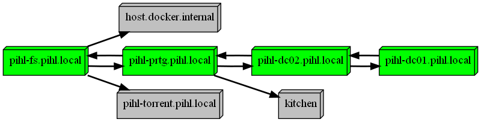
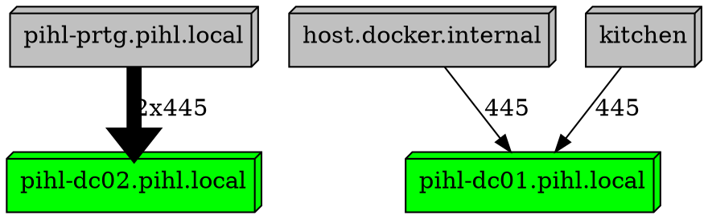

# Plots a picure on server relations

With Netstat collects connections between servers and connects the dots. Exports a picture on the realtionships and ports.

## Version

2019-07-10 Initial code when I got frustrated of bad documentation at customer site.
2022-03-18 Refresh of code. https://github.com/KlasPihl

## Dependency

### [Graphviz](https://graphviz.org/)
*"**What is Graphviz**?
Graphviz is open source graph visualization software. Graph visualization is a way of representing structural information as diagrams of abstract graphs and networks. It has important applications in networking, bioinformatics, software engineering, database and web design, machine learning, and in visual interfaces for other technical domains.
"*
Install by [Chocolaty](https://community.chocolatey.org/)
```powershell
choco install graphviz
```
### [PSGraph](https://github.com/KevinMarquette/PSGraph)

*PSGraph is a helper module implemented as a DSL (Domain Specific Language) for generating GraphViz graphs.*
```powershell
# Install PSGraph from the Powershell Gallery
Find-Module PSGraph | Install-Module

# Import Module
Import-Module PSGraph
```
## Examples
### Example 1
```powershell
"pihl-prtg","pihl-dc01","pihl-dc02","pihl-fs" | .\plot-serverMap.ps1
```


### Example 2
```powershell
"pihl-prtg","pihl-dc01","pihl-dc02" | .\plot-serverMap.ps1 -ShowPorts
```


```dot
digraph g {
    compound="true";
    rankdir="TB";
    node [shape="box3d";]
    "10.254.0.102" [label="pihl-fs.pihl.local";fillcolor="gray";style="filled";]
    "10.254.0.252" [label="pihl-dc02.pihl.local";fillcolor="cyan";style="filled";]
    "10.254.0.253" [label="pihl-dc01.pihl.local";fillcolor="cyan";style="filled";]
    "10.254.0.62" [label="Klient1";fillcolor="gray";style="filled";]
    "10.254.0.73" [label="kitchen";fillcolor="gray";style="filled";]
    "10.254.0.84" [label="pihl-prtg.pihl.local";fillcolor="green";style="filled";]
    "10.254.0.102"->"10.254.0.84" [label="53396";style="bold";color=red;]
    "10.254.0.102"->"10.254.0.84" [label="62243";style="bold";]
    "10.254.0.102"->"10.254.0.84" [label="62246";style="bold";]
    "10.254.0.102"->"10.254.0.84" [label="62247";style="bold";]
    "10.254.0.102"->"10.254.0.84" [label="62248";style="bold";]
    "10.254.0.102"->"10.254.0.84" [label="63960";style="bold";]
    "10.254.0.252"->"10.254.0.84" [label="52145";style="bold";]
    "10.254.0.252"->"10.254.0.84" [label="52152";style="bold";]
    "10.254.0.252"->"10.254.0.84" [label="52153";style="bold";]
    "10.254.0.252"->"10.254.0.84" [label="52154";style="bold";]
    "10.254.0.252"->"10.254.0.253" [label="53899";style="bold";]
    "10.254.0.252"->"10.254.0.84" [label="57254";style="bold";]
    "10.254.0.252"->"10.254.0.84" [label="57255";style="bold";]
    "10.254.0.252"->"10.254.0.253" [label="59463";style="bold";]
    "10.254.0.253"->"10.254.0.84" [label="57297";style="bold";]
    "10.254.0.253"->"10.254.0.84" [label="57298";style="bold";]
    "10.254.0.253"->"10.254.0.84" [label="60319";style="bold";]
    "10.254.0.253"->"10.254.0.84" [label="60325";style="bold";]
    "10.254.0.253"->"10.254.0.84" [label="60326";style="bold";]
    "10.254.0.253"->"10.254.0.84" [label="60327";style="bold";]
    "10.254.0.62"->"10.254.0.84" [label="57252";style="bold";]
    "10.254.0.62"->"10.254.0.84" [label="57290";style="bold";]
    "10.254.0.73"->"10.254.0.84" [label="53855";style="bold";]
    "10.254.0.73"->"10.254.0.84" [label="64847";style="bold";]
    "10.254.0.84"->"10.254.0.253" [label="445";style="bold";]
    "10.254.0.84"->"10.254.0.253" [label="49668";style="bold";]
    "10.254.0.96"->"10.254.0.84" [label="62307";style="bold";]
    "10.254.0.96"->"10.254.0.84" [label="62310";style="bold";]
    "10.254.0.96"->"10.254.0.84" [label="62311";style="bold";]
    "10.254.0.96"->"10.254.0.84" [label="62312";style="bold";]
}
```

## Example 3
```powershell
(Get-ADComputer -SearchBase 'OU=Domain Controllers,DC=pihl,DC=local' -Filter * |
    Select-Object -ExpandProperty DNSHostName) |
    .\plot-serverMap.ps1 -cred $cred -ShowPorts -SelectPort 445
```
